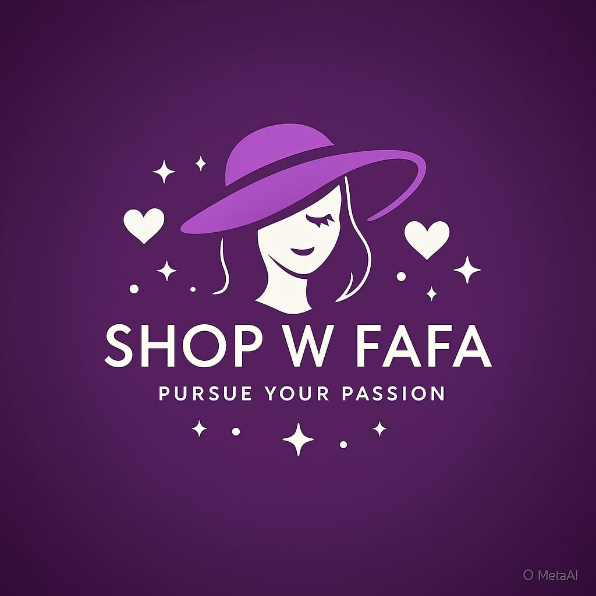
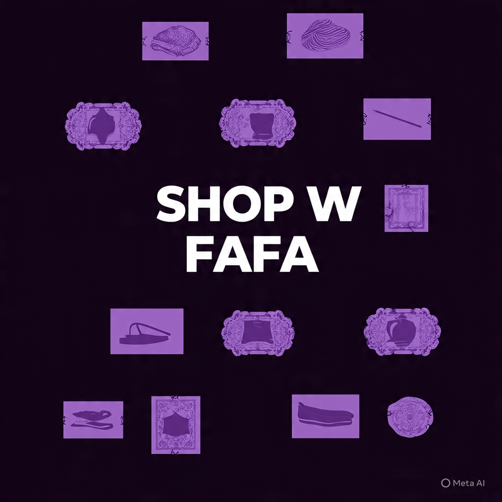
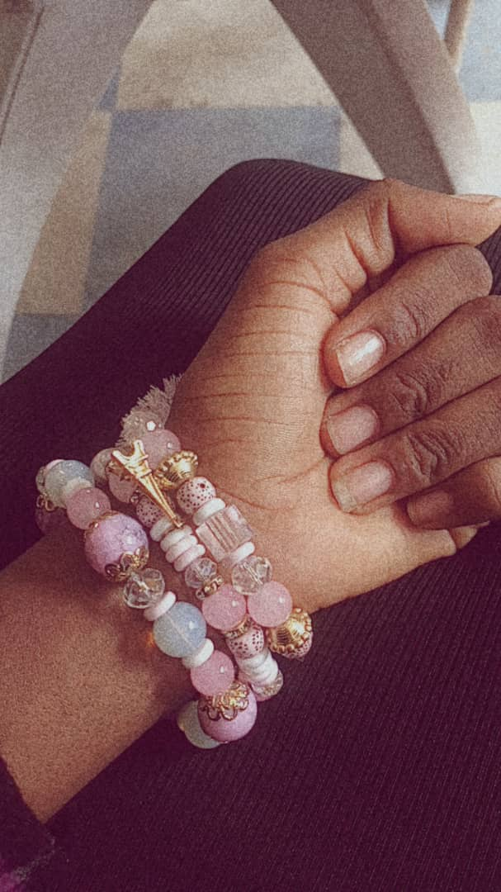
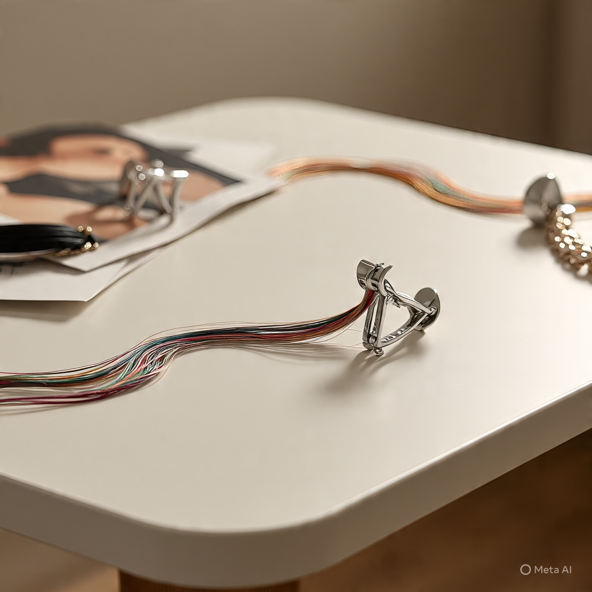
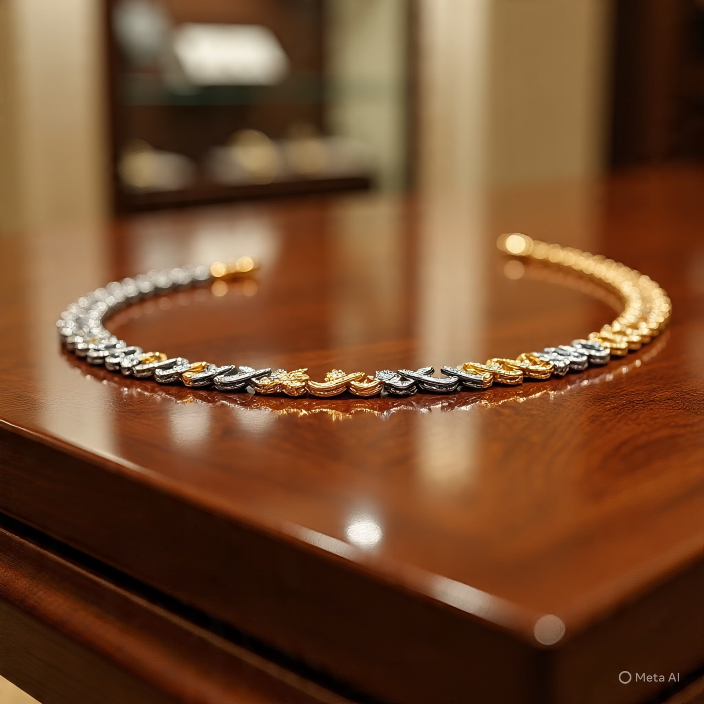
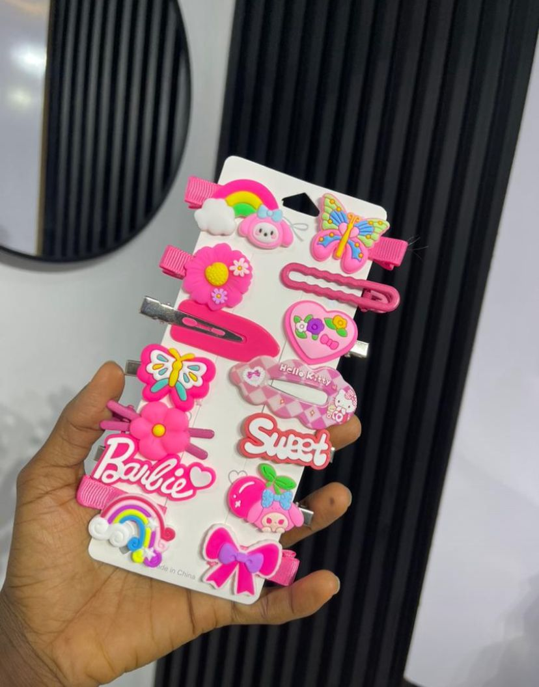
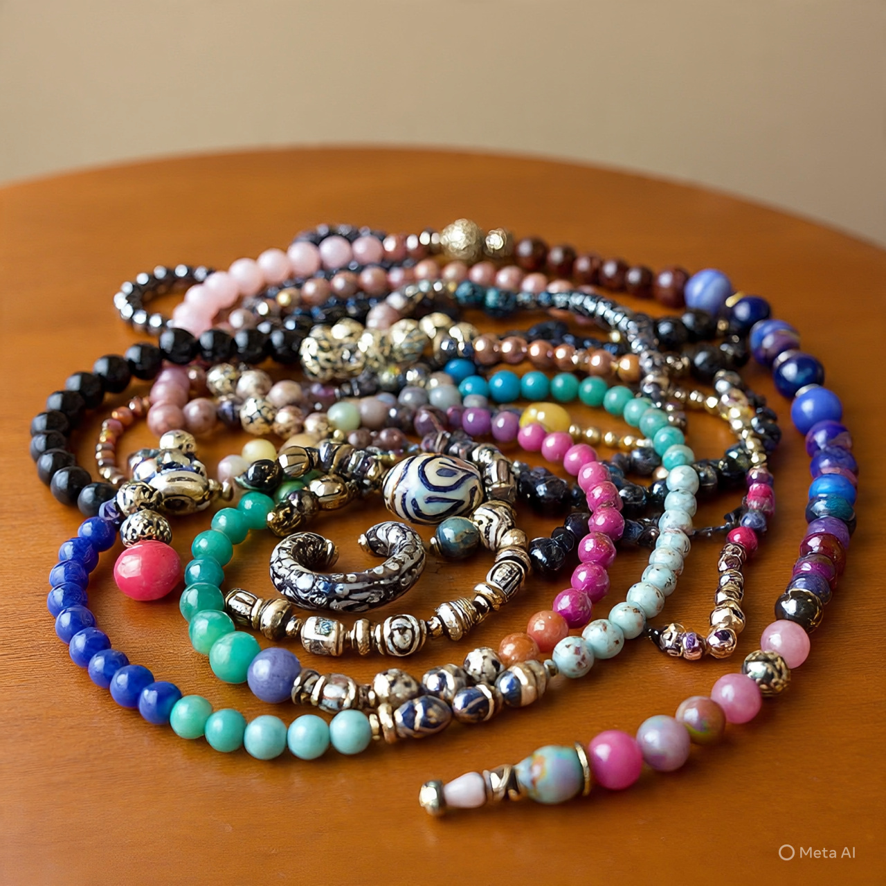
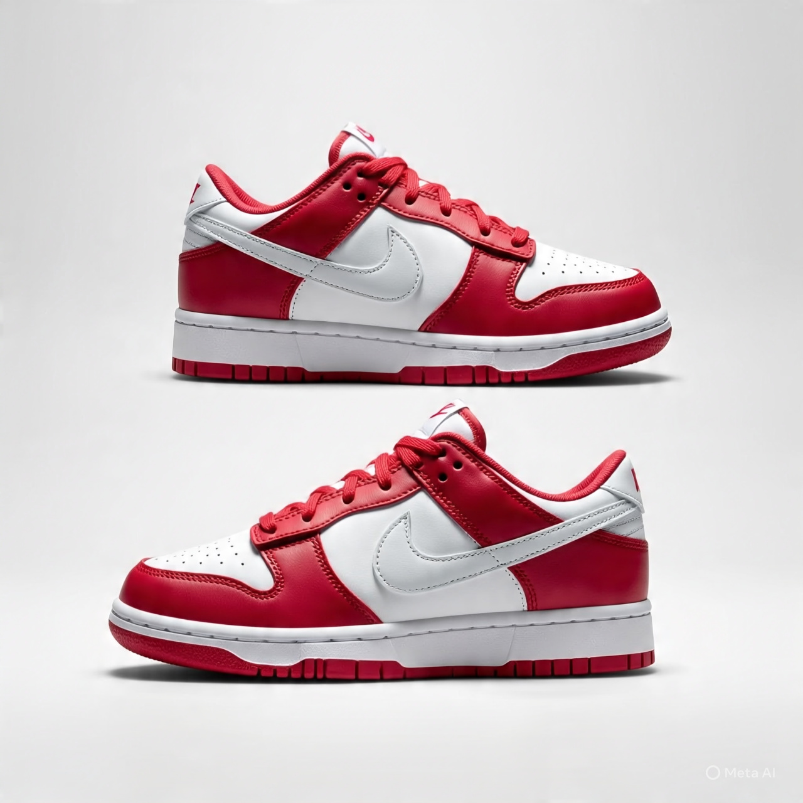
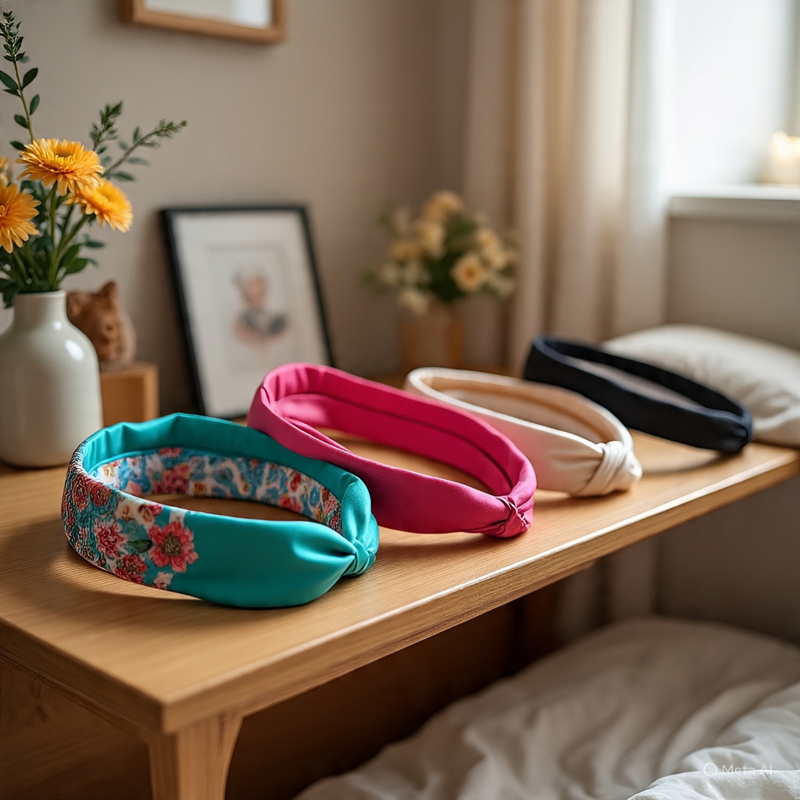
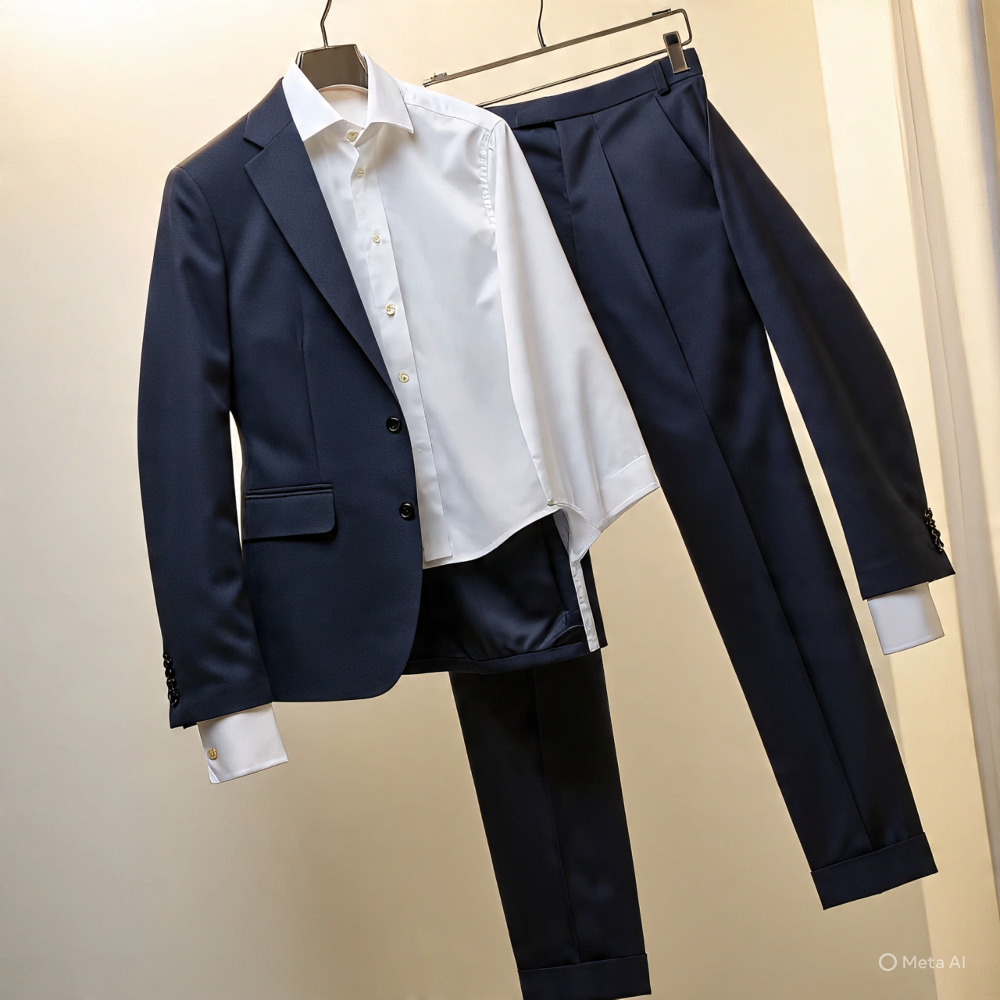

<!DOCTYPE html>
<html lang="en">
<head>
  <meta charset="UTF-8">
  <meta name="viewport" content="width=device-width, initial-scale=1.0">
  <title>SHOP W FAFA | Home</title>
  
  <link href="https://fonts.googleapis.com/css2?family=Playfair+Display:wght@600;700&family=Poppins:wght@300;400;600&display=swap" rel="stylesheet">
  
</head>
<body class="bg-gradient-to-b from-pink-50 via-white to-purple-50 text-gray-900">

  <!-- NAVBAR -->
  <header class="bg-white/90 backdrop-blur sticky top-0 z-50 shadow-sm">
    

      

        
        <a href="index.html" class="text-2xl font-bold text-purple-600 hover:text-purple-700 transition">SHOP W FAFA</a>
      

      <nav class="hidden md:flex gap-6 text-gray-700 font-medium">
        <a href="index.html" class="hover:text-purple-600 transition font-semibold">Home</a>
        <a href="about.html" class="hover:text-purple-600 transition">About</a>
        <a href="shop.html" class="hover:text-purple-600 transition">Shop</a>
        <a href="contact.html" class="hover:text-purple-600 transition">Contact</a>
        <a href="https://wa.me/08038137679" class="bg-purple-600 text-white px-4 py-2 rounded-lg shadow hover:bg-purple-700 hover:scale-105 transition">WhatsApp</a>
      </nav>
      

        <button id="mobileBtn" class="text-2xl">☰</button>
      

    

    

      <a href="index.html" class="font-semibold">Home</a>
      <a href="about.html">About</a>
      <a href="shop.html">Shop</a>
      <a href="contact.html">Contact</a>
      <a href="https://wa.me/08038137679" class="text-purple-600 font-semibold">WhatsApp</a>
    

  </header>

  <!-- HERO SECTION -->
  <section class="grid md:grid-cols-2 items-center gap-6 max-w-7xl mx-auto py-16 px-6 fade-up">
    

      <h1 class="text-5xl font-bold text-purple-600 leading-tight">Affordable & Luxury Fashion</h1>
      

        Welcome to SHOP W FAFA! We provide stylish accessories, hair clips, beads, luxury male & female wears, sundresses, shoes, and surprise gift packages. 
        Our products are crafted to make every customer feel elegant, confident, and unique.
      

      

        <a href="shop.html" class="bg-purple-600 text-white px-6 py-3 rounded-lg shadow hover:bg-purple-700 hover:scale-105 transition">Shop Now</a>
        <a href="about.html" class="text-purple-600 px-6 py-3 rounded-lg border border-purple-600 hover:bg-purple-50 transition">Learn More</a>
      

    

    

      
    

  </section>

  <!-- FOUNDER MESSAGE -->
  <section class="bg-white py-16 px-6 fade-up">
    

      <h2 class="text-3xl font-bold text-purple-600 mb-4">A Message from Noah Faridat</h2>
      

        "Fashion is a statement of confidence, style, and individuality. At SHOP W FAFA, we bring you affordable accessories and luxury wear that cater to modern trends while keeping quality in focus."
      

      

        Every item is chosen with care, and our worldwide shipping ensures our products reach you no matter where you are.
      

    

  </section>

  <!-- FEATURED PRODUCTS -->
  <section class="max-w-6xl mx-auto py-16 px-6 fade-up">
    <h2 class="text-3xl font-bold text-purple-600 text-center mb-8">Special Collection & Discounts</h2>
    

      <!-- PRODUCT 1 -->
      <article class="bg-white rounded-lg shadow hover-scale p-3">
        
        <h3 class="text-sm font-semibold">Beads 001</h3>
        

        <button onclick="messageWhatsApp('Beads 001')" class="mt-2 bg-purple-600 text-white text-xs px-3 py-1 rounded hover:bg-purple-700 transition">Message</button>
      </article>
      <!-- PRODUCT 2 -->
      <article class="bg-white rounded-lg shadow hover-scale p-3">
        
        <h3 class="text-sm font-semibold">Hair Claw 002</h3>
        

        <button onclick="messageWhatsApp('Hair Claw 002')" class="mt-2 bg-purple-600 text-white text-xs px-3 py-1 rounded hover:bg-purple-700 transition">Message</button>
      </article>
      <!-- PRODUCT 3 -->
      <article class="bg-white rounded-lg shadow hover-scale p-3">
        
        <h3 class="text-sm font-semibold">Jean Chain 003</h3>
        

        <button onclick="messageWhatsApp('Jean Chain 003')" class="mt-2 bg-purple-600 text-white text-xs px-3 py-1 rounded hover:bg-purple-700 transition">Message</button>
      </article>

       <!-- PRODUCT 4 -->
      <article class="bg-white rounded-lg shadow hover-scale p-3">
        
        <h3 class="text-sm font-semibold">Neck Chain 004</h3>
        

        <button onclick="messageWhatsApp('Neck Chain 003')" class="mt-2 bg-purple-600 text-white text-xs px-3 py-1 rounded hover:bg-purple-700 transition">Message</button>
      </article>
      <!-- Repeat similarly for all 30 products with different names and discount prices -->
    

  </section>

  <!-- TESTIMONIALS -->
  <section class="bg-purple-50 py-16 px-6 fade-up">
    

      <h2 class="text-3xl font-bold text-purple-600 mb-8">Customer Reviews</h2>
      

        

          
"I love my beads! Affordable and stylish, SHOP W FAFA never disappoints!"

          
- Aisha

        

        

          
"The sundress I ordered arrived quickly and fits perfectly. Highly recommend!"

          
- Chinyere

        

        

          
"Surprise gift packages are amazing. Great value and quality!"

          
- Fatima

        

      

    

  </section>

  <!-- GALLERY SECTION -->
  <section class="max-w-6xl mx-auto py-16 px-6 fade-up">
    <h2 class="text-3xl font-bold text-purple-600 text-center mb-8">Gallery</h2>
    

      
      
      
      
      
      
      
      
      
      
    

  </section>

  <!-- CALL TO ACTION -->
  <section class="bg-purple-100 py-16 text-center fade-up">
    <h2 class="text-3xl font-bold text-purple-600">Shop & Send a Gift Today!</h2>
    
Affordable fashion and luxury wear for all occasions. Surprise someone or treat yourself!

    <a href="shop.html" class="mt-6 inline-block bg-purple-600 text-white px-8 py-4 rounded-lg shadow hover:bg-purple-700 hover:scale-105 transition">Explore Now</a>
  </section>

  <!-- FOOTER -->
  <footer class="bg-white mt-12 py-6 text-center text-gray-500">
    
© 2025 SHOP W FAFA | All Rights Reserved | Developed by VT DESIGNS

  </footer>

  <!-- WHATSAPP CHAT BUTTON -->
  <a href="https://wa.me/08038137679" target="_blank"
     class="fixed right-5 bottom-5 bg-green-500 text-white p-4 rounded-full shadow-lg hover:scale-105 transition z-50">💬</a>

  
</body>
</html>
